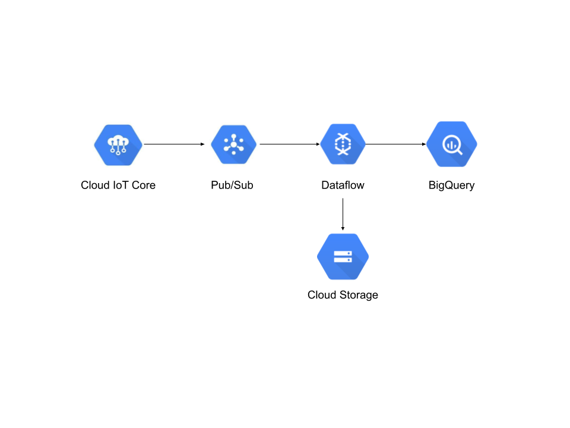

# Building an IoT Analytics Pipeline on Google Cloud Platform (GSP088)

The word `IoT`, internet of things, means the interconnection of physical devices with the global internet. These devices are equipped with sensors in different functions and networking hardware. They are identified globally. They receive the signal to afford rich data in the physical world.

Cloud IoT Core is a service built on the standard message queue telemetry transport protocol (MQTT). It is consisted of two main components, device manager and protocol bridge.

* A `device manager` manages devices so that you can configure or monitor them.
* A `protocol bridge` is built upon MQTT protocol to allow devices to communicate with Cloud IoT Core.


In this tutorial, you will learn four main steps to establish the architecture via Cloud IoT Core.
- Connect and manage MQTT-based devices using Cloud IoT Core.
- Publish and ingest the message from Cloud IoT Core via Pub/Sub API.
- Process the data using Cloud Dataflow.
- Analyze the data using BigQuery.

Keywords: `IoT`, `Cloud IoT Core`, `MQTT`

## Reference

* Qwiklabs: https://www.qwiklabs.com/focuses/605?parent=catalog
* Github Repository: http://github.com/GoogleCloudPlatform/training-data-analyst


## Quick Notes



### Create a Cloud Pub/Sub Topic

Steps:

* In the GCP Console, go to `Navigation menu` > `Pub/Sub` > `Topics`.
* Click `Create a topic` and name it, for example `iotlab`.

You will see the topic url under the topic name (like `projects/gcp-2d2ec9305534/topics/iotlab`). After created a topic, you have to set the permission for the users.

Click the dot bar on the end of topic. In the `View Permissions` and click `Add Memebr`. You can add lots of  members by typing their email, for example, `cloud-example@account.com` . From the `Select a role`, give these members `Pub/Sub` > `Pub/Sub Publisher` role.


### Create a BigQuery dataset

* Create a BigQuery dataset and name it, for example `iotlabdataset`. 
* After created a dataset, you now can create a table, named `sensordata`.

* In the schema, add the following fields.
  * `timestamp`: `Type` is `TIMESTAMP`
  * `device`: `Type` is `STRING`
  * `temperature`: `Type` is `FLOAT`

* Click `Create Table`.


### Create a Cloud Storage Bucket

Here we use `<GCP-Project-ID>-bucket` as the bucket name.


### Set up a Cloud Dataflow Pipeline

* Here I am going to use the template in Dataflow. In the GCP Console > Dataflow, click `CREATE JOB FROM TEMPLATE`.
* Name the job as `iotlabflow`.
* Select the `Cloud Pub/Sub Topic to BigQuery` from the `Cloud Dataflow template`.
* For the `Cloud Pub/Sub input topic`, type the topic name with its full path (topic ID: `projects/gcp-2d2ec9305534/topics/iotlab`).
* For the `BigQuery output table`, type the table created above(table ID: `gcp-2d2ec9305534:iotlabdataset.sensordata`).
* For the `Temporary location`, type the bucket url created above (`gs://gcp-2d2ec9305534-bucket/tmp`, tmp is the folder which is created in the future).
* You can setup the `Max workers` to the number of all devices.
* Click `Run Job`.


### Prepare your compute engine VM

Here we use VMs as the IoT devices.

```sh
sudo pip install virtualenv
virtualenv -p python3 venv
source venv/bin/activate

sudo apt-get remove google-cloud-sdk -y
curl https://sdk.cloud.google.com | bash
exit
```

```sh
source venv/bin/activate

gcloud init
gcloud components update
gcloud components install beta

sudo apt-get update
sudo apt-get install python-pip openssl git -y
pip install pyjwt paho-mqtt cryptography
git clone http://github.com/GoogleCloudPlatform/training-data-analyst
```


### Create a registry for IoT devices 

```sh
export PROJECT_ID=<your-project-id>
export MY_REGION=<your-working-region>

# create a registry
gcloud beta iot registries create iotlab-registry \
   --project=$PROJECT_ID \
   --region=$MY_REGION \
   --event-notification-config=topic=projects/$PROJECT_ID/topics/iotlab
```


### Create a Cryptographic Keypair

```sh
git clone http://github.com/GoogleCloudPlatform/training-data-analyst
cd $HOME/training-data-analyst/quests/iotlab/
openssl req -x509 -newkey rsa:2048 -keyout rsa_private.pem \
    -nodes -out rsa_cert.pem -subj "/CN=unused"
```


### Add simulated devices to the registry

Register the first IoT device.

```sh
gcloud beta iot devices create temp-sensor-buenos-aires \
  --project=$PROJECT_ID \
  --region=$MY_REGION \
  --registry=iotlab-registry \
  --public-key path=rsa_cert.pem,type=rs256
```

Register the second IoT device.

```sh
gcloud beta iot devices create temp-sensor-istanbul \
  --project=$PROJECT_ID \
  --region=$MY_REGION \
  --registry=iotlab-registry \
  --public-key path=rsa_cert.pem,type=rs256
```


### Run simulated devices

```sh
cd $HOME/training-data-analyst/quests/iotlab/
wget https://pki.google.com/roots.pem
```

Simulate the first IoT device.

```sh
python cloudiot_mqtt_example_json.py \
   --project_id=$PROJECT_ID \
   --cloud_region=$MY_REGION \
   --registry_id=iotlab-registry \
   --device_id=temp-sensor-buenos-aires \
   --private_key_file=rsa_private.pem \
   --message_type=event \
   --algorithm=RS256 > buenos-aires-log.txt 2>&1 &
```

Simulate the second IoT device.

```sh
python cloudiot_mqtt_example_json.py \
   --project_id=$PROJECT_ID \
   --cloud_region=$MY_REGION \
   --registry_id=iotlab-registry \
   --device_id=temp-sensor-istanbul \
   --private_key_file=rsa_private.pem \
   --message_type=event \
   --algorithm=RS256
```


### Analyze the Sensor Data Using BigQuery

In the BigQuery, type the following sql command.

```sql
SELECT timestamp, device, temperature from iotlabdataset.sensordata
ORDER BY timestamp DESC
LIMIT 100
```

